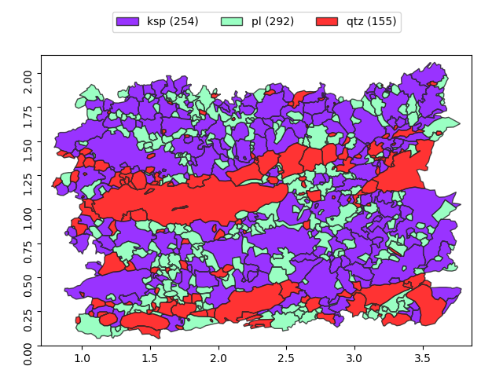
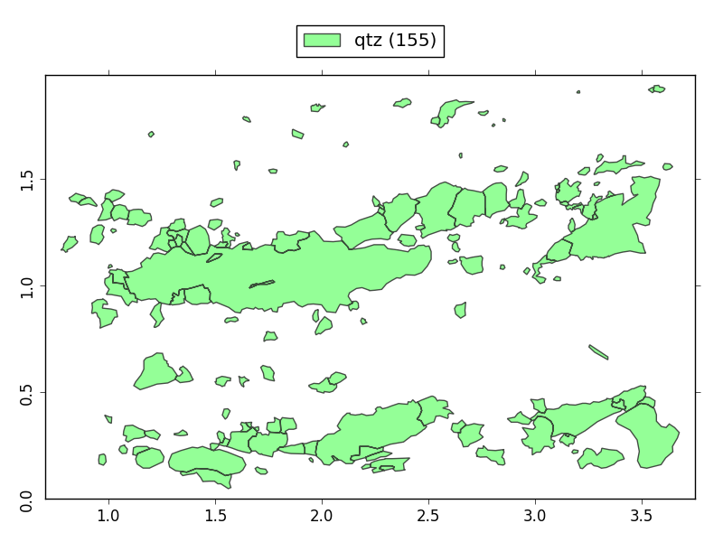
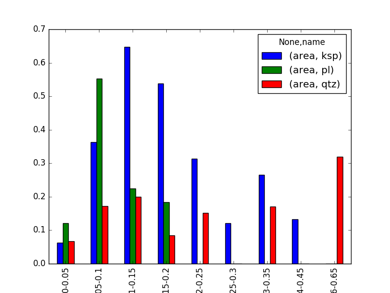
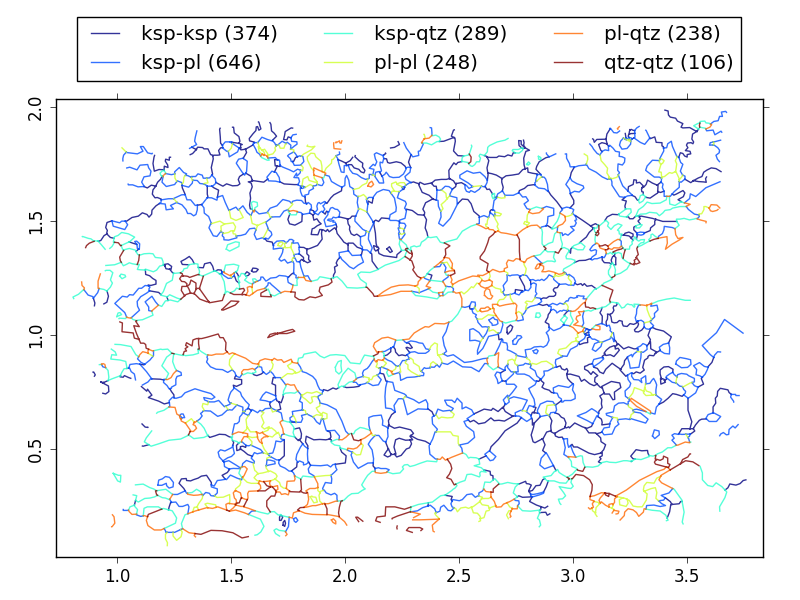

Tutorial
========

The microstructural analysis is a powerful, but underused tool of
petrostructural analysis. Except acquirement of common statistical parameters,
this technique can significantly improve understanding of processes of grain
nucleation and grain growth, can bring insights on the role of surface
energies or quantify duration of metamorphic and magmatic cooling events as
long as appropriate thermodynamical data for studied mineral exist. This
technique also allows systematic evaluation of degree of preferred
orientations of grain boundaries in conjunction with their frequencies. This
may help to better understand the mobility of grain boundaries and
precipitations or removal of different mineral phases.

We introduce a new platform, object-oriented Python package PolyLX providing
several core routines for data exchange, visualization and analysis of
microstructural data, which can be run on any platform supported by
Scientific Python environment.

Basic usage
-----------

To start working with **PolyLX** we need to import polylx package. For
convinience, we will import polylx into actual namespace::

    >>> from polylx import *

To read example data, we can use ``Grains.example`` method. Note that we
create new ``Grains`` object, which store all
imported features (polygons) from shapefile::

    >>> g = Grains.example()

To visualize grain objects from shape file, we can use ``show`` method
of Grains object::

    >>> g.show()

To show only 'qtz' phase, we can use fancy indexing::

    >>> g['qtz'].show()

Grains support dot notation to access individual properties.
Note that most of properties are returned as ``numpy.array``::

    >>> g['qtz'].ar  # get axial ratios
    array([ 1.46370088,  3.55371458,  1.43641139,  1.26293055,  2.10676277,
            1.45200805,  1.98973326,  1.97308557,  2.13420187,  1.76682269,
            1.70083897,  1.38205897,  1.88811465,  1.59948827,  2.50452919,
            1.60296389,  1.4918233 ,  2.15318719,  1.27665794,  1.38714959,
            1.67235338,  2.33179583,  1.30609967,  2.73148246,  1.02760669,
            1.33627299,  2.65451284,  1.29069569,  1.73051094,  1.25763409,
            1.90027316,  2.56110638,  1.78555385,  2.40926108,  2.26741705,
            1.71957235,  1.79168709,  1.04770164,  1.293186  ,  1.29420065,
            1.48331817,  2.15510614,  2.21246419,  1.57101091,  2.01989715,
            1.1428675 ,  2.02888455,  4.07405108,  1.47968881,  1.24770095,
            1.4750185 ,  1.37946472,  1.49048108,  1.56668345,  1.43717521,
            1.59756777,  1.58948843,  2.12557437,  2.54316052,  1.98917177,
            1.29809155,  1.70022052,  1.40121941,  1.24674038,  1.50255058,
            1.42880415,  1.73447054,  2.3548111 ,  1.52891827,  3.26773221,
            1.33011244,  2.26173396,  3.2151532 ,  2.15638456,  1.61602624,
            1.13898611,  2.91625233,  1.94275485,  2.68487563,  1.12446842,
            1.48814907,  1.79425743,  1.19512385,  1.28301942,  1.39853133,
            1.59860483,  3.80709622,  1.75016693,  1.59940152,  1.43972155,
            1.09439109,  2.00023212,  1.87470191,  1.04157011,  1.48561371,
            1.14172901,  1.48211332,  1.52569202,  1.59357336,  1.58054224,
            1.86890813,  1.84729576,  1.45085424,  1.4400654 ,  2.6284034 ,
            1.62077026,  1.35218688,  1.69040095,  1.2829313 ,  2.7380623 ,
            1.55901231,  1.72569674,  1.18396915,  1.67864861,  2.40971617,
            2.08496427,  2.12907657,  1.20981316,  1.46045276,  1.55428179,
            4.6980536 ,  2.32570855,  1.95106722,  1.81174297,  4.08295286,
            2.04530043,  1.56215221,  1.42587721,  1.70016792,  1.78887212,
            2.17273986,  2.47995119,  4.59660941,  3.43961286,  3.04193405,
            2.91162332,  2.98790473,  2.55352686,  1.33076709,  7.09385883,
            1.91715238,  1.47161362,  2.39020581,  1.51938795,  1.87839843,
            1.9946499 ,  2.27873759,  4.50321651,  5.78162231,  6.9806063 ,
            1.3177092 ,  2.33701528,  1.86371784,  1.26166336,  1.28322623])

More conviniet way to work with Grains attributes is collect any properties
to ``pandas.DataFrame`` using ``df`` method::

    >>> g.df('la', 'sa', 'lao', 'area', 'length', 'ead', 'ar').head(10)
               la        sa         lao      area    length       ead        ar
    fid
    0    0.066027  0.045110   70.596636  0.002286  0.186196  0.053956  1.463701
    1    0.099033  0.057029   70.983857  0.004409  0.258753  0.074922  1.736522
    2    0.074248  0.020893   61.438248  0.001123  0.175821  0.037813  3.553715
    3    0.045232  0.031489   85.088587  0.001005  0.134427  0.035779  1.436411
    4    0.136445  0.108038  170.839835  0.011489  0.398558  0.120948  1.262931
    5    0.073578  0.044938  123.223347  0.002471  0.201258  0.056090  1.637319
    6    0.103567  0.065119  149.397514  0.005213  0.283110  0.081474  1.590441
    7    0.103189  0.077988   23.758847  0.005951  0.318774  0.087048  1.323142
    8    0.187049  0.036611   82.108720  0.004407  0.404066  0.074904  5.109041
    9    0.270513  0.128402   76.193288  0.024576  0.729051  0.176894  2.106763

Once you have ``pandas.DataFrame``, check pandas manual to what you can do.
Here is fe examples::

    >>> g.df('ead').describe()
                  ead
    count  701.000000
    mean     0.072812
    std      0.056812
    min      0.000350
    25%      0.037140
    50%      0.058338
    75%      0.093503
    max      0.638144

``agg`` method aggregate properties according to defined classification
(name by default)::

    >>> g.agg('area','sum', 'ead', 'mean', 'name', 'count')
                    area       ead  name
    name_class
    ksp         2.443733  0.089710   254
    pl          1.083516  0.060629   292
    qtz         1.166097  0.068071   155

The ``groups`` method return ``pandas.GroupBy`` object which allows any
pandas-style manipulation::

    >>> g.groups('ead', 'area', 'la', 'sa').describe().T
    name_class           ksp          pl           qtz
    area count  2.540000e+02  292.000000  1.550000e+02
         mean   9.620995e-03    0.003711  7.523208e-03
         std    1.548182e-02    0.004170  2.778736e-02
         min    3.464873e-07    0.000003  9.629176e-08
         25%    1.341681e-03    0.001148  6.930225e-04
         50%    4.304819e-03    0.002289  1.805471e-03
         75%    1.115444e-02    0.004694  4.892680e-03
         max    1.323812e-01    0.028416  3.198359e-01
    ead  count  2.540000e+02  292.000000  1.550000e+02
         mean   8.970974e-02    0.060629  6.807125e-02
         std    6.495077e-02    0.032438  7.054971e-02
         min    6.641998e-04    0.001850  3.501464e-04
         25%    4.133005e-02    0.038226  2.970151e-02
         50%    7.403298e-02    0.053984  4.794577e-02
         75%    1.191733e-01    0.077308  7.892656e-02
         max    4.105520e-01    0.190210  6.381439e-01
    la   count  2.540000e+02  292.000000  1.550000e+02
         mean   1.295772e-01    0.086681  1.019395e-01
         std    1.053259e-01    0.053220  1.366152e-01
         min    1.013949e-03    0.006461  1.017291e-03
         25%    5.439610e-02    0.050202  4.314167e-02
         50%    9.871911e-02    0.072777  7.151284e-02
         75%    1.793952e-01    0.106761  1.206513e-01
         max    8.097226e-01    0.279398  1.437277e+00
    sa   count  2.540000e+02  292.000000  1.550000e+02
         mean   7.545538e-02    0.049585  5.255111e-02
         std    5.428555e-02    0.027663  4.632415e-02
         min    3.648908e-04    0.000583  1.457310e-04
         25%    3.370683e-02    0.031980  2.183093e-02
         50%    6.643814e-02    0.043545  3.640605e-02
         75%    1.021515e-01    0.063468  6.490102e-02
         max    3.252086e-01    0.166726  3.035541e-01

The ``classify`` method could be used to define new classification, based
on any property and using variety of methods::

    >>> g.classify('ead', k=6)
    >>> df = g.df('class', 'name', 'area')
    >>> df.head()
           ead_class name      area
    fid
    0    0.048-0.066  qtz  0.002286
    1    0.066-0.091   pl  0.004409
    2    0.030-0.048  qtz  0.001123
    3    0.030-0.048  qtz  0.001005
    4    0.091-0.141  qtz  0.011489

To summarize results for individual phases per class we can use
``pandas.pivot_table``::

    >>> pd.pivot_table(df,index=['ead_class'], columns=['name'], aggfunc=np.sum)
                     area
    name              ksp        pl       qtz
    ead_class
    0.000-0.030  0.017510  0.015057  0.015377
    0.030-0.048  0.035587  0.096870  0.043866
    0.048-0.066  0.077185  0.170371  0.065184
    0.066-0.091  0.214921  0.305016  0.079672
    0.091-0.141  0.612776  0.296543  0.218996
    0.141-0.638  1.485754  0.199659  0.743003

or we can directly plot it::

    >>> pd.pivot_table(df,index=['ead_class'], columns=['name'], aggfunc=np.sum).plot(kind='bar')

Work with boundaries
--------------------

The ``Boundaries`` object could be created from grains with correct
topology (use OpenJUMP, QGIS or ArcGIS to validate grain shapefile topology)::

    >>> b = g.boundaries()
    >>> b.show()

Most of methods and properties demonstrated for ``Grains`` are valid also
for boundaries::

    >>> b.agg('sum', 'length')
                   length
    name_class
    ksp-ksp     23.383974
    ksp-pl      38.592227
    ksp-qtz     17.920424
    pl-pl       11.302490
    pl-qtz      11.535006
    qtz-qtz      6.617133

